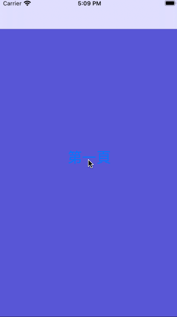

# pp#1-熟悉 App gif 錄製，GitHub，Medium

專案名稱：ppIOSPlayGif

Gif擷取軟體：[LICEcap](https://www.cockos.com/licecap/)

此專案作為在[彼得潘的iOS App程式設計入門](https://www.apppeterpan.com/)的第一份作業

沒有程式碼撰寫，作為練習使用Gif軟體擷取App操作的用途

